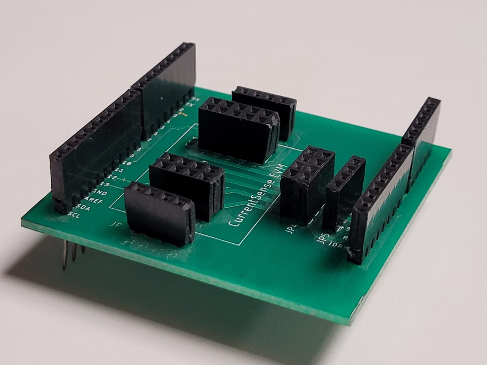
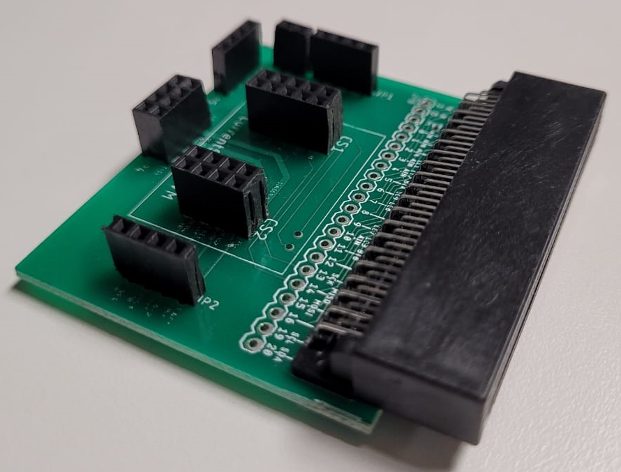
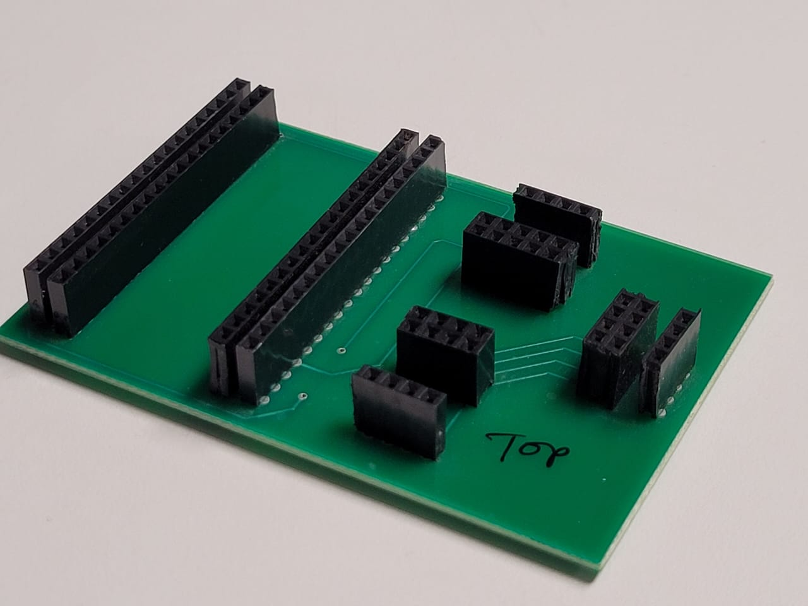
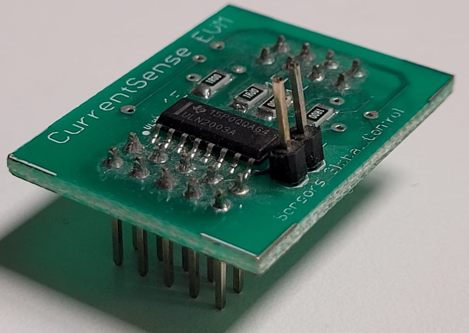
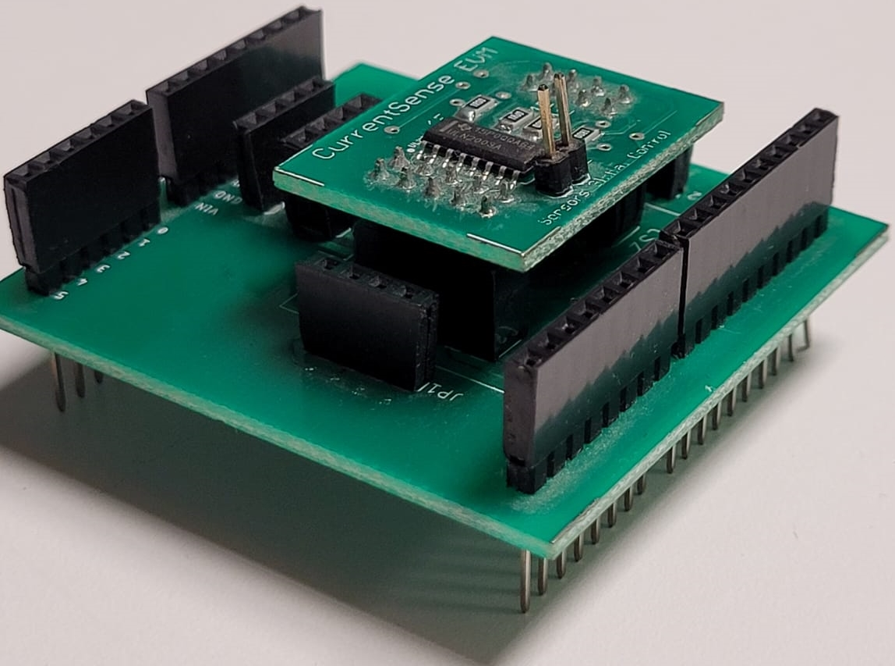
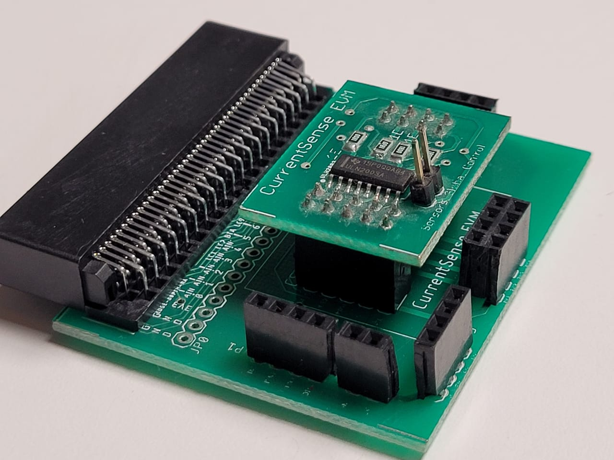
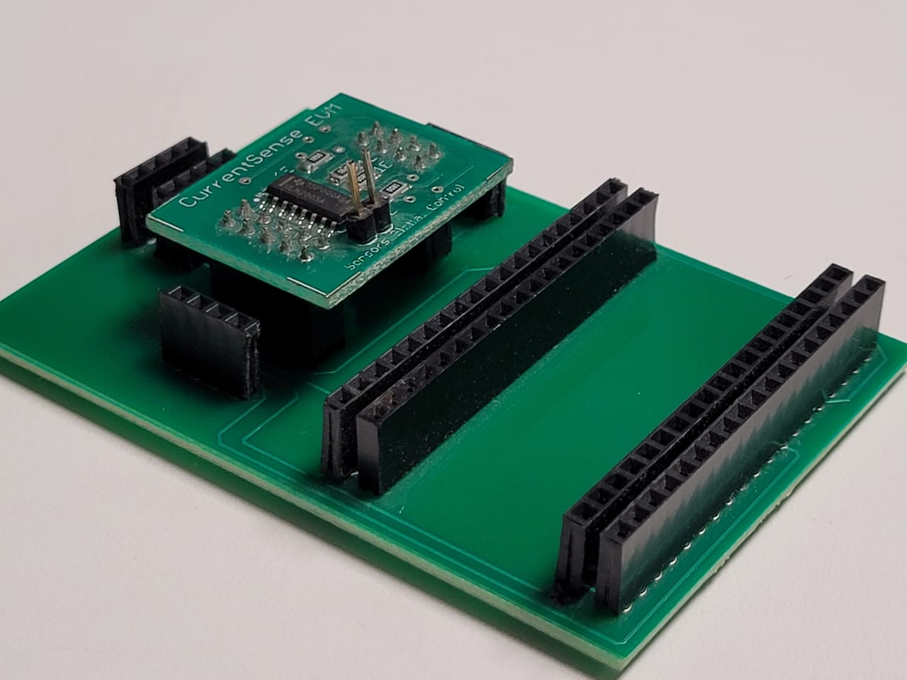

# PCB files for Verified Telemetry Hardware 

Includes Gerber, Assembly, Schematic, Board and BOM files for manufacturing of hardware required to setup Verified Telemetry on MX Chip, STM32 and ESP32. 
The hardware consists of CS hat and CS baseboards specific to MCU.

CS hat contains the components required to sample signals and communicate them to the MCU using SPI. CS hat gets fixed on the baseboard and no other wiring is required to setup the hardware. 

Baseboards are used to route the right pins on the MCU to the CS hat for VT functioning. 

## ST Microelectronics B-L475E-IOT01A / B-L4S5I-IOTOA1 Discovery kit Baseboard

## MXChip AZ3166 IoT DevKit Baseboard

## ESP 32 Baseboard

## CurrentSense (CS) Hat

