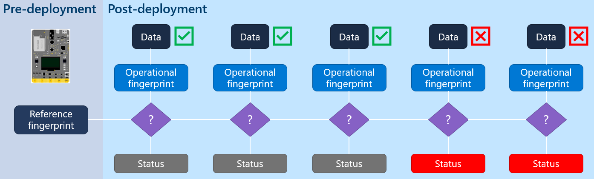
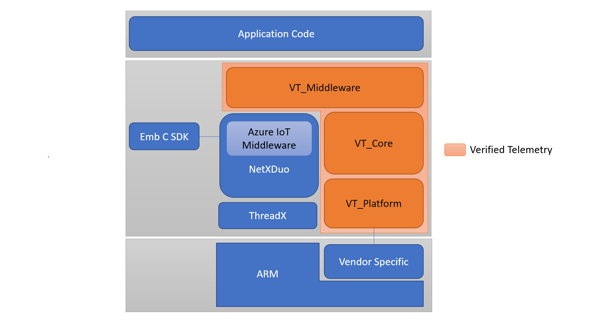

[](https://github.com/Azure/Verified-Telemetry/actions/workflows/build-core.yaml)
[](https://codecov.io/gh/Azure/verified-telemetry)

# Verified Telemetry Overview
The quality of sensor data is fundamental for driving IoT adoption. Since IoT sensors are made of low-cost components, deployed in-the-wild and in harsh environments, they are prone to failures leading to faulty or dirty data. The effect of bad data will lead to the well-known garbage-in garbage-out process, leading to cascading ill-effects upstream and at times catastrophic decisions.  

Verified Telemetry (VT) is a state-of-the-art solution to determine the health of the sensor, i.e., working or faulty, which is consequently used to determine the quality of the sensed data. This is achieved by devising an intelligent “sensor fingerprint”, a set of unique electrical characteristics that differs between working and faulty sensors. The fingerprints can detect faults for a wide variety of off-the-shelf sensors and can be easily implemented with lightweight software code running on the IoT device. This novel approach empowers customers with a reliable and automated way to remotely measure and observe the health of the sensor in real-time alongside the data collected. The data associated with a validated fingerprint results in verified telemetry (as shown below).



# Table of Contents

* [Architecture](https://github.com/Azure/Verified-Telemetry#architecture)
* [File Structure](https://github.com/Azure/Verified-Telemetry#file-structure)
* [Dependencies](https://github.com/Azure/Verified-Telemetry#dependencies)
* [Samples](https://github.com/Azure/Verified-Telemetry#samples)
	* [Device Samples](https://github.com/Azure/Verified-Telemetry#device-samples)
	* [Solution Samples](https://github.com/Azure/Verified-Telemetry#solution-samples)
* [Resource Requirements](https://github.com/Azure/Verified-Telemetry#resource-requirements)
* [Plug and Play Model for VT](https://github.com/Azure/Verified-Telemetry#plug-and-play-model)
* [Usage Guide](https://github.com/Azure/Verified-Telemetry#usage-guide)
	* [Implementing Platform level functions](https://github.com/Azure/Verified-Telemetry#implementing-platform-level-functions)
	* [Middleware API Documentation](https://github.com/Azure/Verified-Telemetry#middleware-api-documentation)
	* [Integration of VT with existing device code](https://github.com/Azure/Verified-Telemetry#integration-of-VT-with-existing-device-code)


# Architecture
Verified Telemetry Library currently supports Azure RTOS and uses the following components:
* [Azure NetX Duo.](https://github.com/azure-rtos/netxduo) Provides a full TCP/IP IPv4 and IPv6 network stack, and networking support integrated with ThreadX.
* [Azure IoT Middleware for Azure RTOS](https://github.com/azure-rtos/netxduo/tree/master/addons/azure_iot) Platform specific library that acts as a binding layer between the Azure RTOS and the Azure SDK for Embedded C.

The architecture of VT library is also shown below:



# File Structure
The VT library has been structured around the following components:
* [Core.](./src/core) This module includes core functions to support verified telemetry, such as functions to collect, validate and evaluate sensor fingerprints.
* [Middleware.](./src/middleware) This module contains implementations to support interactions with Azure IoT Middleware for Azure RTOS.
* [Platform.](./src/platform) This module helps in making the library compatible with several hardware devices and OS kernels.

The structure of the library is as follows:
* **/inc** Contains Header files for core, middeware and platform components

* **/src** Contains implementations for all the header files in **/inc**.

* **/PnPModel** Contains impementations for sample PnP models to support Verified Telemetry.

* **/tests** Contains test cases for [VT Core](./src/core) 

* **CmakeLists.txt**  
	CMake script to generate build files.	
	Verified Telemetry provides several options to customize the library according to the project requirement:
	* `VT_UNIT_TESTING` : Settting this ON compiles [test cases](./tests) for [VT Core](./src/core) but disables [VT Middleware](./src/middleware)
	* `VT_CODE_COVERAGE` : Setting this ON calculates the code coverage of the [test cases](./tests) for [VT Core](./src/core)

# Dependencies
Verified Telemetry is dependant on following SDK:
  * [NetXDuo](https://github.com/azure-rtos/netxduo/tree/feature/iot_pnp)

# Samples
We provide multiple device and solution samples to showcase the usage of verified Telemetry. Please follow the Getting Started Guides below to see Verified Telemetry in action. 
## Device Samples 
The [device samples](https://github.com/Azure/Verified-Telemetry-Device-Sample) shows device developers how to include Verified Telemetry with Azure IoT on Azure RTOS.

## Solution Samples 
The [solution samples](https://github.com/Azure/Verified-Telemetry-Solution-Sample) showcase how the Verified Telemetry features can be utilised in real world scenarios. This uses InfluxDB, Grafana and the [Azure IoT Node.js SDK](https://github.com/Azure/azure-iot-sdk-node) to communicate with Azure IoT Hub.

# Resource Requirements
We expect Verified Telemetery code to run on microcontrollers, which have very limited amounts of flash and RAM. Below is our resource requirements to add verified telemetry code:

| `Flash`       |  46 Kb  |																				  
|---------------|---------|
| `RAM`		    | 14 Kb   |

# Plug and Play Model
Verified Telemetry Library provides capabilities for interaction using a Plug and Play Model.
Details about this model can be found [here](./PnPModel).

# Usage Guide

## Implementing Platform level functions
* For Verified Telemetry to work, it requires some platform specific functions to be defined at the application layer and then passed down to the library when VT is initialized.
* Function type definitions can be found in [platform.h](./inc/platform/vt_platform.h)
* Here is a summarised list of the functions that need to be defined by the application developer
	| Platform Function 	| Requirements to be implemented by Application Developer                                	| Required? 	|
	|-------------------	|----------------------------------------------------------------------------------------	|:---------:	|
	| adc_init          	| Should initialize ADC when the controller and channel are passed as arguments          	|    YES    	|
	| adc_read          	| Should return ADC data when the controller and channel are passed as arguments         	|    YES    	|
	| gpio_on           	| Should set a GPIO pin HIGH when the GPIO port and pin are passed as arguments          	|    YES    	|
	| gpio_off          	| Should set a GPIO pin LOW when the GPIO port and pin are passed as arguments           	|    YES    	|
	| tick_init         	| Should initialize a tick counter with a time resolution that is passed as an argument  	|    YES    	|
	| tick_deinit       	| Should de-initialize a running tick counter                                            	|    YES    	|
	| tick              	| Should return the present tick value                                                   	|    YES    	|
	| interrupt_enable  	| Should enable global interrupts on the MCU                                             	|  OPTIONAL 	|
	| interrupt_disable 	| Should disable global interrupts on the MCU                                            	|  OPTIONAL 	|
* Samples for implementation of platform functions can be found [here](https://github.com/Azure/Verified-Telemetry-Device-Sample/blob/main/MXChip/AZ3166/app/sample_vt_device_driver.c) in the Device Samples

## Middleware API Documentation
| Function | Description |
|-|-|
| [nx_vt_init](https://azure.github.io/Verified-Telemetry/nx__verified__telemetry_8h.html) | Initializes Global Verified Telemetry |
| [nx_vt_signature_init](https://azure.github.io/Verified-Telemetry/nx__verified__telemetry_8h.html#af097ec10f7efe9e8ef6505166938b46c) | Initializes an instance of Verified Telemetry Information Interface |
| [nx_vt_process_command](https://azure.github.io/Verified-Telemetry/nx__verified__telemetry_8h.html) | Processes all commands supported by VT Middleware |
| [nx_vt_process_property_update](https://azure.github.io/Verified-Telemetry/nx__verified__telemetry_8h.html) | Processes all desired property updates supported by VT Middleware |
| [nx_vt_properties](https://azure.github.io/Verified-Telemetry/nx__verified__telemetry_8h.html)  | Creates payloads and sends all reported properties supported by VT Middleware |
| [nx_vt_send_desired_property_after_boot](https://azure.github.io/Verified-Telemetry/nx__verified__telemetry_8h.html#ad468475e9e6479ceb198ebabc888730a) | Update value of desired properties in the Digital Twin after first boot |
| [nx_vt_process_reported_property_sync](https://azure.github.io/Verified-Telemetry/nx__verified__telemetry_8h.html) | Synchronizes VT Settings stored in digital Twin as reported properties at startup |
| [nx_vt_verified_telemetry_message_create_send](https://azure.github.io/Verified-Telemetry/nx__verified__telemetry_8h.html#acf3d2ce9f5f948886380e7c5003232ed) | Creates and sends telemetry JSON with message properties containing telemetry status |
| [nx_vt_compute_evaluate_fingerprint_all_sensors](https://azure.github.io/Verified-Telemetry/nx__verified__telemetry_8h.html#a1e590a098a15b05ff917c846ba34f034) | Computes status of all telemetries which have been initialized to provide Verified Telemetry |
| [nx_vt_azure_iot_pnp_client_component_add](https://azure.github.io/Verified-Telemetry/nx__verified__telemetry_8h.html#a44f7374f9f470f0652b9cebf0dbd8183) | Adds VT Information Interfaces that are initialized to the nx_pnp_client object |

## Integration of VT with existing device code
* Developers can refer to the [Device Samples](https://github.com/Azure/Verified-Telemetry-Device-Sample) for Verified Telemetry sample code. 

### Step 1: Include Verified Telemetry library
* In the root folder, run the following command
	```shell
	git submodule add https://github.com/Azure/Verified-Telemetry.git core/lib/verified-telemetry
	```
* Include library files in [getting-started/MXChip/AZ3166/lib/CMakeLists.txt](https://github.com/azure-rtos/getting-started/blob/master/MXChip/AZ3166/lib/CMakeLists.txt)
	```
	add_subdirectory(${CORE_LIB_DIR}/verified-telemetry verified_telemetry)
	```
### Step 2: Initialize Verified Telemetry
* Global Verified Telemetry needs to be initialized with the device specific platform functions
* Similarly, to initalize Verified Telemetry for a particular sensor/telemetry the details of sensor connection must be passed using the nx_vt_signature_init function
* An example of usage of [nx_vt_init](https://azure.github.io/Verified-Telemetry/nx__verified__telemetry_8h.html) and [nx_vt_signature_init](https://azure.github.io/Verified-Telemetry/nx__verified__telemetry_8h.html#af097ec10f7efe9e8ef6505166938b46c) functions is shown below
* Include headers for VT
	```C
	#include "nx_verified_telemetry.h"
	```
* Include header which define platform specific device drivers
	```C
	#include "sample_vt_device_driver.h"
	```
* Define Verified Telemetry DB which will store configuration, platform specific device drivers and runtime information
	```C
	static NX_VERIFIED_TELEMETRY_DB verified_telemetry_DB;
	```
* Define variable of VT_DEVICE_DRIVER type which will contain pointers to platform specific functions required by VT
	```C
	static VT_DEVICE_DRIVER sample_device_driver;
	```
* Define a variables of NX_VT_OBJECT type for each telemetry that will be supporting Verified Telemetry
	```C
	static NX_VT_OBJECT sample_signature_sensor_1;
	// static NX_VT_OBJECT sample_signature_sensor_2;
	static NX_VT_OBJECT sample_signature_sensor_N;
	```
* Define variables of VT_SENSOR_HANDLE type which will contain connection information for each sensor
	```C
	static VT_SENSOR_HANDLE sample_handle_sensor_1;
	// static VT_SENSOR_HANDLE sample_handle_sensor_2;
	static VT_SENSOR_HANDLE sample_handle_sensor_N;
	```
* Define a Verified Telemetry User Initialization wrapper function which will make calls to necessary initilization function from the vT library and return pointer to the configured NX_VERIFIED_TELEMETRY_DB variable 
	```C
	NX_VERIFIED_TELEMETRY_DB* sample_nx_verified_telemetry_user_init()
	{
	    UINT status;

		sample_device_driver.adc_init          = &vt_adc_init;
		sample_device_driver.adc_read          = &vt_adc_read;
		sample_device_driver.gpio_on           = &vt_gpio_on;
		sample_device_driver.gpio_off          = &vt_gpio_off;
		sample_device_driver.tick_init         = &vt_tick_init;
		sample_device_driver.tick_deinit       = &vt_tick_deinit;
		sample_device_driver.tick              = &vt_tick;
		sample_device_driver.interrupt_enable  = &vt_interrupt_enable;
		sample_device_driver.interrupt_disable = &vt_interrupt_disable;

		if ((status = nx_vt_init(&verified_telemetry_DB, (UCHAR*)"vTDevice", true, &sample_device_driver)))
		{
			printf("Failed to configure Verified Telemetry settings: error code = 0x%08x\r\n", status);
		}

		sample_handle_sensor_1.adc_id         = vt_adc_id_sensor_1;
		sample_handle_sensor_1.adc_controller = (void*)&vt_adc_controller_sensor_1;
		sample_handle_sensor_1.adc_channel    = (void*)&vt_adc_channel_sensor_1;
		sample_handle_sensor_1.gpio_id        = vt_gpio_id_sensor_1;
		sample_handle_sensor_1.gpio_port      = (void*)vt_gpio_port_sensor_1;
		sample_handle_sensor_1.gpio_pin       = (void*)&vt_gpio_pin_sensor_1;

		if ((status = nx_vt_signature_init(&verified_telemetry_DB,
				&sample_signature_sensor_1,
				(UCHAR*)"soilMoistureExternal1",
				VT_SIGNATURE_TYPE_FALLCURVE,
				(UCHAR*)"soilMoistureExternal1",
				true,
				&sample_handle_sensor_1)))
		{
			printf("Failed to initialize VT for soilMoistureExternal1 telemetry: error code = 0x%08x\r\n", status);
		}
		
		return (&verified_telemetry_DB);
	}
	```
* Call the Verified Telemetry User Initialization wrapper function and update verified_telemetry_DB
	 ```C
	verified_telemetry_DB = sample_pnp_verified_telemetry_user_init();
	 ```
* A complete sample can be found [here](https://github.com/Azure/Verified-Telemetry-Device-Sample/blob/main/MXChip/AZ3166/app/sample_nx_verified_telemetry_init.c)

### Step 3: Use VT Middleware APIs based on the following guidelines 

* Use this function to initialize VT PnP Components
	```C
	nx_vt_azure_iot_pnp_client_component_add(verified_telemetry_DB, iotpnp_client_ptr)
	```
* Call these functions once after boot
	```C
	nx_vt_send_desired_property_after_boot(verified_telemetry_DB, pnp_client_ptr, message_type)
	```

	```C
	nx_vt_process_reported_property_sync(
            verified_telemetry_DB, pnp_client_ptr, component_ptr, component_len, &name_value_reader, version)
	```
* Call these functions at fixed time intervals
	```C
	nx_vt_properties(verified_telemetry_DB, &(context->iotpnp_client))
	```

	```C
	nx_vt_compute_evaluate_fingerprint_all_sensors(verified_telemetry_DB)
	```

* Use this function to send telemetry
	```C
	nx_vt_verified_telemetry_message_create_send(handle->verified_telemetry_DB,
			iotpnp_client_ptr,
			handle->component_name_ptr,
			handle->component_name_length,
			NX_WAIT_FOREVER,
			(UCHAR*)scratch_buffer,
			buffer_length)
	```

* Desired Property Callback
	```C
	nx_vt_process_property_update(
                verified_telemetry_DB, pnp_client_ptr, component_ptr, component_len, &name_value_reader, version)
	```

* Command Callback
	```C
	nx_vt_process_command(verified_telemetry_DB,
                  &(sample_context_ptr->iotpnp_client),
                  (UCHAR*)component_name_ptr,
                  component_name_length,
                  (UCHAR*)pnp_command_name_ptr,
                  pnp_command_name_length,
                  &json_reader,
                  &json_writer,
                  &status_code))
	```